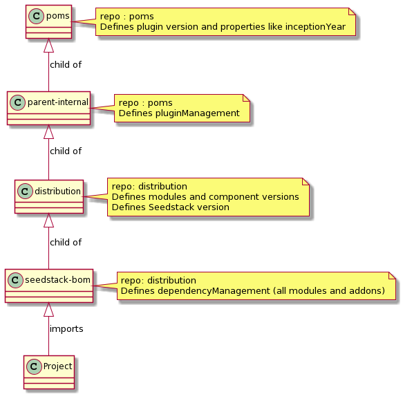

# Seedstack – Developer Guide

## Overview

### SCM (Source Code Management)

https://github.com/seedstack
Requires a github account.

68 repositories (sorted by modification date, in descending order, on project page)

### Continuous Integration
Use travis https://travis-ci.org/ for building project.

- .travis.yml files are part of source code

Current release frequency is of about 4 distributions per year.

Note: Seedstack is compatible with WebSphere (including zOS distribution) and Tomcat. 

### Architecture

A parent pom defines minimal version of the APIs.
A bom, used for distribution, defines the individual versions of the component that make up the global Seedstack version. 

Each module contains a comprehensive changelog, with standard codes to describe changes:

- [fix]
- [new]
- [brk]
- [chg]

Note: the framework is quite stable (still, security API remains quite cumbersome).

#### Plugins

- specs -> contains the APIs. The presence of API in the classpath does not triggers any specific behaviour.

- core -> implementation of the specs. The presence of an implementation triggers activation of the plugin. 

The same layout is used at the module level.

Class Seed contains the kernel, which manages classpath scanning at start-up. 

Note: Seedstack manages annotation inheritance, including at interface level, and including among annotations. 

Class SeedServletContainerInitializer self-registers (lazy initialization, without synchronization), through Java service mechanism (META-INF/services). 

It is the same mechanism that is used for low-level plugins. 

Class GracefulShutdonwnHandler enables a clean shutdown of plugins and modules. 

Plugins are located under seed.core.internal. 

Every plugin is associated to a module that manages injection. 

#### Modules

A “core” Guice module manages other Guice modules. 

@Install (org.seedstack.seed): Guice module declaration that enables automatic detection and installation. 

@Bind (org.seedstack.seed): individual binding. 

#### Initialization

InitContext (io.nuun.kernel.api.plugin.context) 
- contains implementations found in the classpath, 
- contains the plugins

#### Maven

As of version 18.11, Maven must be launched using JDK v11 (openjdk can be downloaded from https://jdk.java.net/). 
Command “mvn install” may fail due to license error if mvn runnable does not contain license information. 

Solution: 

-	Run: mvn license:format

Example:

    [‎14/‎12/‎2018 15:16]  ADRIEN LAUER - U083051:  
    mvn versions:set versions:commit -DnewVersion=3.8.1-SNAPSHOT 

In the project, the Seedstack framework import is done through dependencyManagement configuration, adding seedstack-bom dependency.

File seedstack-bom-<version>.pom declares framework dependencies, and pulls dependency versions from project org.seedstack.distribution. 

File distribution-<version>.pom defines the versions versions of the components (coffig, business, addons, etc).

### Java

Seedstack requires Java version 8+, and is compiled using JDK v11. 

Note: in particular, Seedstack uses Java 8 predicates (see https://docs.oracle.com/javase/8/docs/api/java/util/function/Predicate.html)

### User examples

Source code for the examples is available under https://github.com/seedstack/samples

It contains three projects:
- addons
- basics
- full-apps

For usage information, see seedstack.org.

Applications can be launched using command: mvn seedstack:watch, in parallel with Chrome plugin LiveReload. (new plugin for source change detection).

## Local Developpement and Test

Developments on Seedstack are made on forked copies of main repository. 

Fork https://github.com/seedstack/seed project, then clone your forked project.

If required, set upstream in forked project; for example:

    git remote add upstream https://github.com/seedstack/distribution.git

One can develop and test directly in seed project (prefer IT tests), and in a test project. 
To implement current framework developments in a test project, one has two possibilities, as seen below. 

### Testing using updated test project dependencies (recommended!)

In you test project, override the dependency version to the module you are updating. 

For example: 

    <dependency>
        <groupId>org.seedstack.seed</groupId>
        <artifactId>seed-rest-jersey2</artifactId>
        <version>3.8.1-SNAPSHOT</version>
    </dependency>

Or 

    <dependency>
        <groupId>org.seedstack.seed</groupId>
        <artifactId>seed-web-core</artifactId>
        <version>3.8.1-SNAPSHOT</version>
    </dependency> 

### Testing using distribution project

Fork, then checkout project https://github.com/seedstack/distribution.

#### seed/pom.xml

If required: 
- update current version (e.g. 3.8.0-SNAPSHOT)
- under dependencyManagement, update version for org.seedstack:seedstack-bom (e.g. 18.11-SNAPSHOT)

#### distribution/pom.xml

If required:
- update version (e.g. 18.11-SNAPSHOT)
- update seed.version (e.g. 3.8.0-SNAPSHOT)

#### distribution/seedstack-bom/pom.xml

If required:
- update version (ex. 18.11-SNAPSHOT)

### Integration tests

Integration tests can be run using:

    mvn integration-test

### Configuration

Classes can be mapped to configuration objects from application.yaml using @Config annotation. 

Warning: Attributes cannot be static to be mappable.

Attributes can be mapped to configuration objects using @Configuration annotation.

Config Tool can find configuration classes (@Config] and their non-static attributes.

It cannot find usages of @Configuration annotation.

EffectiveConfig tool displays user-defined configuration based on application<.override>.(yaml|yml|json|properties) files available in the classpath.

## Usage tips

### How to populate database

Example with MongoDB for application called hseed, having 

domain package:
-	class Client (extends BaseAggregateRoot<ClientId>), 
-	class ClientId (extends BaseValueObject), 
-	interface ClientRepository (extends Repository<Client, ClientId>)

interface package:
-	class ClientRepositoryImpl (extends BaseMorphiaRepository<Client, ClientId> and implements ClientRepository)

infrastructure package:
- class ClientDto (POJO) with DataSet annotation, where 
  - group = "hseed":
  - name = "client" : associated object
- class ClientDtoImporter : extends BaseDataImporter<ClientDto>

Method importData is overridden, for example with:

    dtos.forEach(dto -> repository.add(new Client(new ClientId(dto.getId()), dto.getCode())));

test/resources/META-INF/data/hseed/client.json : file containing data to load. 

#### Configuration properties

In application.yaml or preferably application.override.yaml, properties can be set for DataConfig object.
Available properties are 
- importOnStart (default = true)
- clearBeforeImport (default = true)
- forceImport (default = true)

For example:

    business:
      data:
        forceImport: true

### ConfigTool

ConfigTool enables access to various information regarding configuration.

#### Effective config

Dumps the configuration as scanned, parsed and aggregated by SeedStack

See: http://seedstack.org/docs/maven-plugin/effective-config/

Maven

    mvn -q seedstack:effective-config 
Java

    java -Dseedstack.tool=effective-config -jar target/hsweb-capsule.jar

#### Config

Dumps all the configuration options available in the project

See: http://seedstack.org/docs/maven-plugin/config/

Maven

    mvn -q seedstack:config

Java

    java -Dseedstack.tool=config -jar target/hsweb-capsule.jar
 

## Appendices

### Intellij Plugin

Enables developer to link configuration properties (in application.yaml) with associated classes. 

See: 
- https://github.com/seedstack/intellij-plugin 
- http://seedstack.org/posts/intellij-plugin-released/ 

Note: not totally functional with Intellij Community Edition 2017. 

