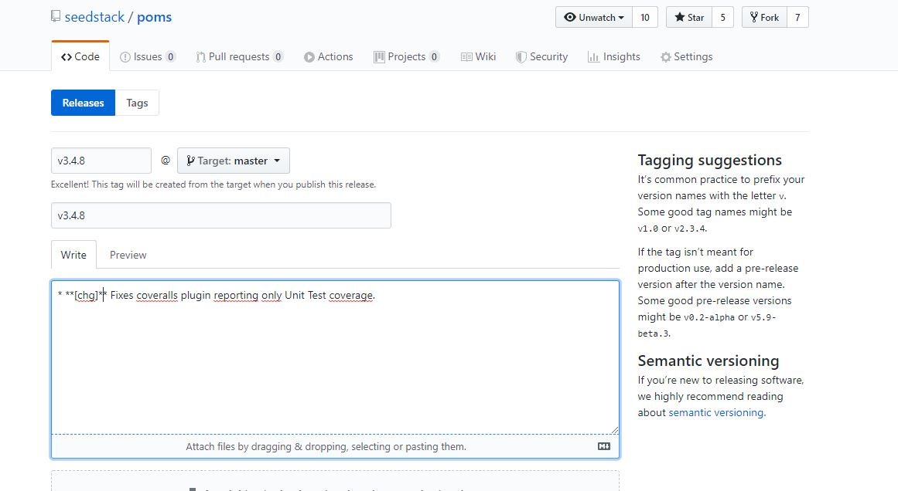

# Versioning and Release

Seedstack version is declared in pom.xml file of distribution project. 
Releasing a new versions starts with update of version in this project: 

	mvn versions:set versions:commit -DnewVersion=19.11-SNAPSHOT
	
Version numbers are formated as follows: 
	Version number = year.month<.revision>
Where month can be: 
- 1 (January)
- 4 (April)
- 7 (July) 
- 11 (November)

Release process itself is triggered by a commit after "-SNAPSHOT" removal from version. 
In other words, the tag associated with version x.y.z includes pom.xml files with x.y.z-SNAPSHOT versions.
(The tag is not on a x.y.z version.)

# Release Process

Identify components to release, so as to update their version in distribution's pom.xml

## bintray

###  Overview

bintray site is a deposit for Seedstack released deliverables, before they are transfered to Maven Central (Maven Central is owned by sonatype, publishing requires specific credentials). 

The "Latest Activity" lists all released componnents, especially those released after latest "distribution". 

###  Release 19.11

No component has been released since version 19.7. 

##  Github

###  Overview

Github lists repositories order by latests modification date, decreasing. 
Like in bintray, this enables to identify all components modified since latest change to "distribution" project.

For each component:
- Read CHANGELOG.md file to see if a new release is required, and if changes required an update of distribution.
- Read pom.xml to see if component depends on -SNAPSHOT dependencies. If yes, dependency must be released first. 

Some projects are updated outside of releaes process:
- samples
- website
- seedstack.github.io

###  Release 19.11

#### kafka-addon
Changlog indicates no update since 2.0.0.
Commit list shows only tests have been added since 2.0.0.

=> Nothing to do

#### poms
Changes:
Update of checkstyle plugin dependency.

Github:
- Update changelog version date.
- Copy changes.
- Releases -> Draft a new release
- Paste version v3.4.8 (start with a "v") as tag, and comment
- Paste changes in Comment, with starts to get the bullet list, and adding bold (two stars) on change type. 
(See capture)

This triggers a build in Travis CI, and pushes the artifacts to bintray

bintray:
jars (Maven) -> publish all

#### seed
Update change log date
Change pom.xml parent (v3.4.8)
Commit -> Push (nheverest)
Pull Request between nheverest and seedstack
Validation by Adrien

This triggers a build in Travis CI

Release :
v3.9.1
- Copy changes.
- Releases -> Draft a new release
- Paste version v3.4.8 (start with a "v") as tag, and comment
- Paste changes in Comment, with starts to get the bullet list, and adding bold (two stars) on change type. 

This triggers a build in Travis CI.

bintray
==> bintray (276 unpublished files = ok)
jars -> "Publish all"

#### business
v4.3.0
- Copy changes.
- Releases -> Draft a new release
- Paste version v4.3.0 (start with a "v") as tag, and comment
- Paste changes in Comment, with starts to get the bullet list, and adding bold (two stars) on change type. 

This triggers a build in Travis CI.

bintray
==> bintray (52 unpublished files = ok)
jars -> "Publish all"

#### jpa-addon (depends on business)
Use seedstack 3.9.1

#### scheduling-addon
Use seedstack 3.9.1

#### jms-addon
Use seedstack 3.9.1
#### oauth-addon
Use seedstack 3.9.1

#### feign-addon
Use seedstack 3.9.1

#### distribution
Use seedstack 3.9.1
Name proposal: Tulip

#### clp-addon (https://github.psa-cloud.com/fnd00)

